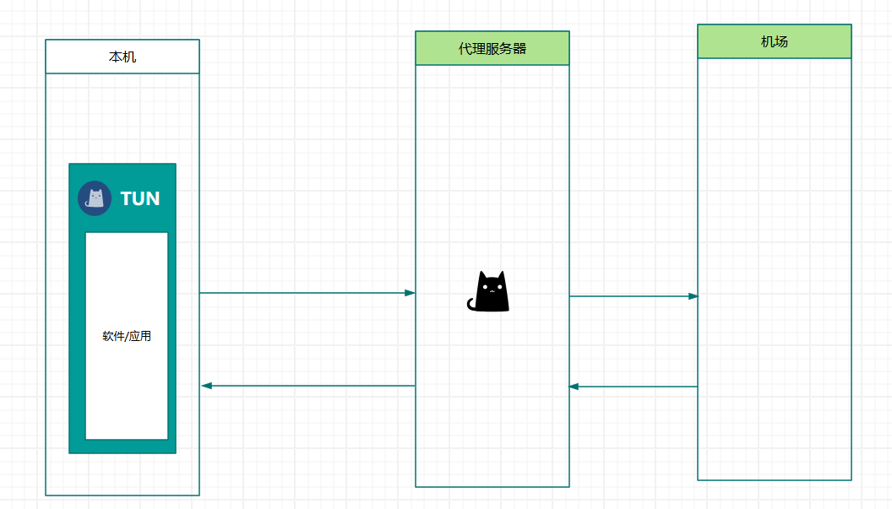
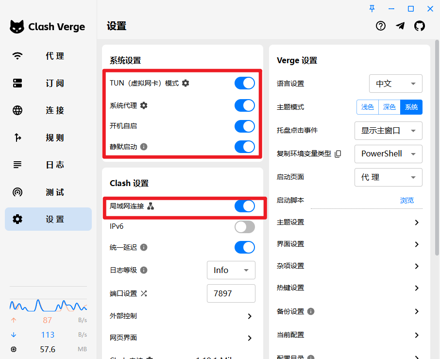
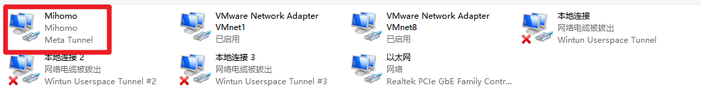
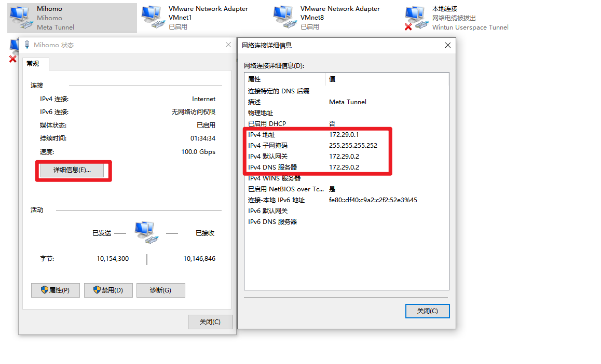
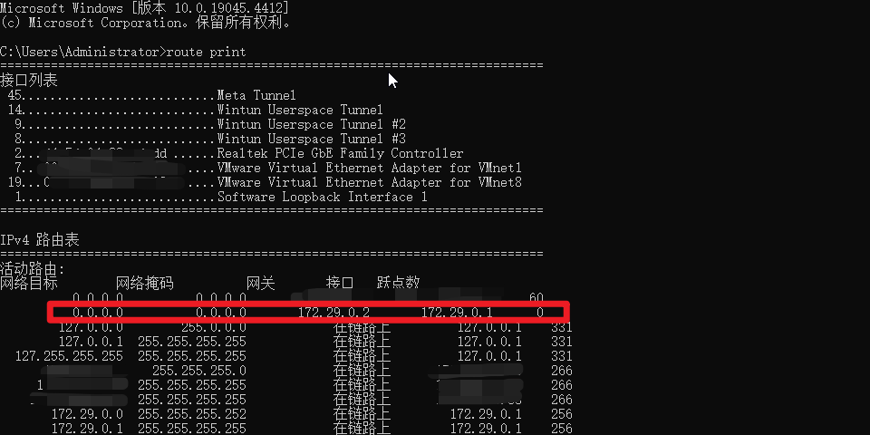
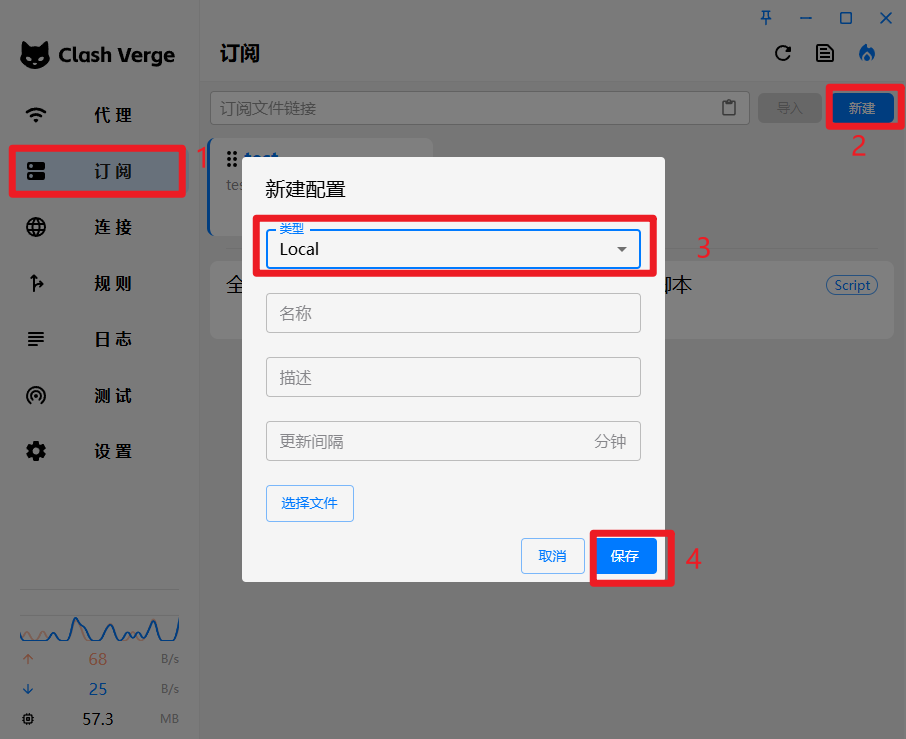
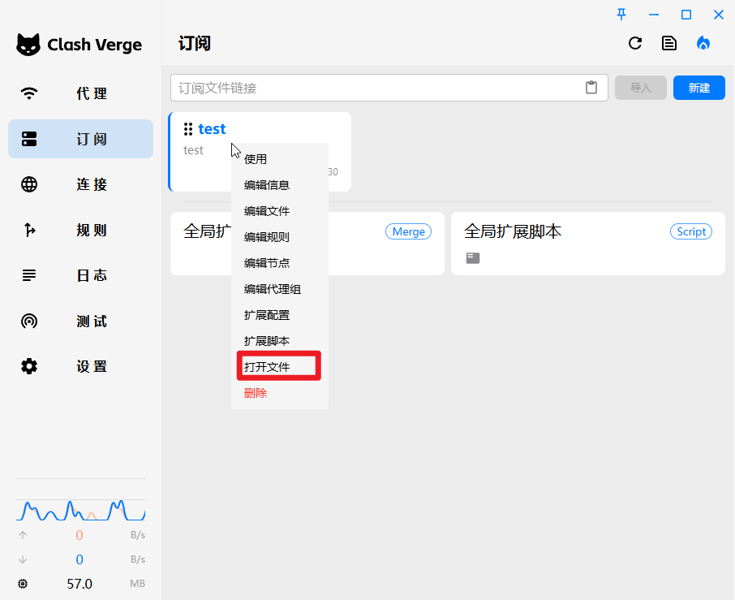
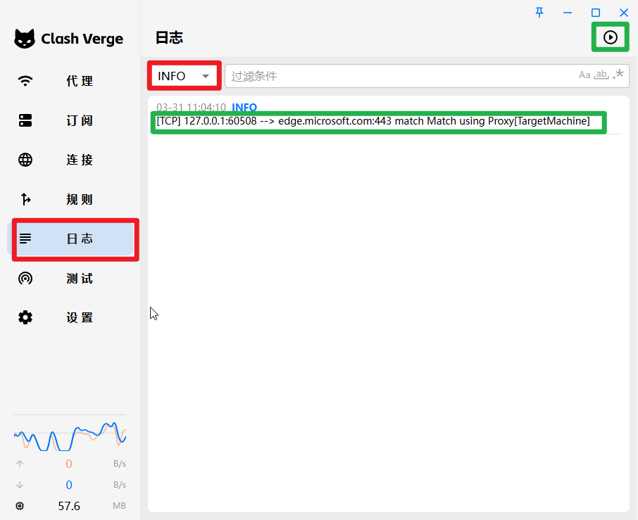

# clash-verge-re集合TUN模式实现全局代理,并实现流量转发功能


## 需求

​	1.本机没有网络,需要使用代理服务器上网,需要将本机的所有流量发到代理服务器上

​	2.实现DNS也经过代理服务器处理(不经过的话,那么首次通过域名查询,耗时较长)

## 介绍

### TUN

 对于不遵循系统代理的软件，TUN 模式可以接管其流量并交由 CFW 处理，在 Windows 中，TUN 模式性能比 TAP 模式好

**TUN/TAP 设备**：虚拟网络设备，TUN 处理 **三层（IP 层）** 的数据包，TAP 处理 **二层（以太网帧）**。Clash 主要使用 TUN 模式。

**用户态交互**：TUN 设备将内核网络栈的原始 IP 数据包传递给用户态程序（如 Clash），由用户态程序处理后重新注入内核。

#### **与传统 Redirect 模式的区别**

| **特性**   | **TUN 模式**           | **Redirect 模式**                 |
| ---------- | ---------------------- | --------------------------------- |
| 工作层级   | IP 层（三层）          | 传输层（四层，iptables 端口转发） |
| 协议支持   | 全协议（TCP/UDP/ICMP） | 仅 TCP/UDP                        |
| 配置复杂度 | 需管理路由和 TUN 设备  | 依赖 iptables/nftables            |
| 系统兼容性 | 跨平台（需管理员权限） | 仅限 Linux/Unix                   |

#### 总结

​	Clash 的 TUN 模式通过虚拟网络设备劫持系统流量，结合用户态规则引擎实现灵活代理，是一种底层、通用的透明代理方案，适用于复杂网络环境和跨平台场景(大白话:通过建立虚拟网卡,使用`route`命令,将默认流量(`0.0.0.0`)都发送到`该虚拟网卡`上,将处理完成的结果返回给软件/应用)。

​	如不希望使用clash自带的TUN模式,也可以自行使用`tun2socks`进行处理,[[教程\] 在 Windows 上使用 tun2socks 进行全局代理 ](https://tachyondevel.medium.com/教程-在-windows-上使用-tun2socks-进行全局代理-aa51869dd0d)


## 实现逻辑

由于本机没有网络,需要将网络转发到代理服务器(多了一台代理服务器)(类似于`旁路由`)

还有一部分的功能是不需要转发到代理服务器的,需要自定义流量出栈规则

​	

## 系统版本

​	`windows 10`

## 软件版本

​	`class-verge-re:v2.0.3`


## 操作步骤

1. 在本机/代理服务器上均安装`class-verge-re`

2. 代理服务器连接机场并进行测试网络连通性(代理服务器如果和本机是在同一个网段/虚拟机,建议在`settings-allow Lan`开关打开)

3. 代理服务器 点击`Profiles` ,在`Global Extend Config`点击右键,选择`Edit File`

   填入`find-process-mode: off` ,该项是指仅做路由规则

   举例:

   ​	如访问 http://abc/hello.sh接口,预期是返回该接口的响应

   ​	如果不配置 `find-process-mode: off`,那么`class-verge-re`会尝试寻找本机的`hello.sh`

   ​	

4. 本机`clash-verge-re`设置

   

   按图中的,全部进行勾选

5. 查看系统网卡

    

   本机会出现`Mihomo`网卡

   

   

   可以看到,`Mihomo`的网卡设置的默认`IP`是`172.29.0.x`

   同时,右下角的`clash-verge-re`图标会变成`绿色`

6. 查看本机路由

   `CMD`输入命令 `route print`

   

   可以看到 默认路由规则`0.0.0.0`  第一个跃点数(跃点数为`0`)对应到的网关是 `172.29.0.2`

   正好对应到第4步的`Mihomo`网卡配置

7. 调整本机`clash-verge-re`的配置

   

   按照图中步骤进行操作, 名称填入`test`

   

   在`test` 点击右键,选择`打开文件`

8. 编辑配置文件

   ```
   # Profile Template for Clash Verge
   dns:
     use-hosts: true
     use-system-hosts: true
     proxy-server-nameserver:
       - http://192.168.11.80:7893
     nameserver:
       - 114.114.114.114 # 默认值
       - 8.8.8.8 # 默认值
       - tls://dns.rubyfish.cn:853 # DNS over TLS
       - https://1.1.1.1/dns-query # DNS over HTTPS
       - dhcp://en0 # 来自 dhcp 的 dns
       # - '8.8.8.8#en0'
   
   hosts:
     mock.mock: 192.168.11.80
   proxies:
     - name: TargetMachine
       type: socks5
       server: 192.168.11.80
       port: 7893
   proxy-groups:
     - name: Proxy
       type: select
       proxies:
         - TargetMachine
   rules:
     - DOMAIN-SUFFIX,storage.flutter-io.cn,TargetMachine
     - DOMAIN-SUFFIX,pub.flutter-io.cn,TargetMachine
     - IP-CIDR,192.168.200.20/32,REJECT
     - IP-CIDR,192.168.200.165/32,DIRECT
     - IP-CIDR,192.168.200.0/24,DIRECT
     - IP-CIDR,192.168.11.0/24,DIRECT
     - IP-CIDR,127.0.0.0/24,DIRECT
     - DOMAIN-SUFFIX,mock.mock,DIRECT
     - DOMAIN-SUFFIX,release.gitkraken.com,REJECT
     - MATCH,Proxy
   
   ```

   里面列举了几段内容:

   ​	`proxy-server-nameserver:` 换成你的代理服务器`IP`和`端口`

   ​	`hosts` 中的节点,可以按需设置,类似于系统中的`hosts`作用

   ```
   proxies:
     - name: TargetMachine
       type: socks5
       server: 192.168.11.80
       port: 7893
   ```

   `server` 和`port`调整你的代理服务器`IP`和`端口`

   `rules` 路由规则 ,可以根据我的示例自定义配置(规则越靠前,匹配优先级越高)

   ​	在`rules`的最后,就会匹配到`Proxy`(也就是会将流量发到`代理服务器`)

9. 测试

   1. 在本机打开`class-verge-re`点击 `日志`,选择`Info`日志级别,点击运行

      

   2. 在本地使用网络工具(比如浏览器) ,输入任意域名,查看是否会出现第一步的`绿色`方框结果(这个结果代表已经将流量发送到`TargetMachine`代理服务器)

      