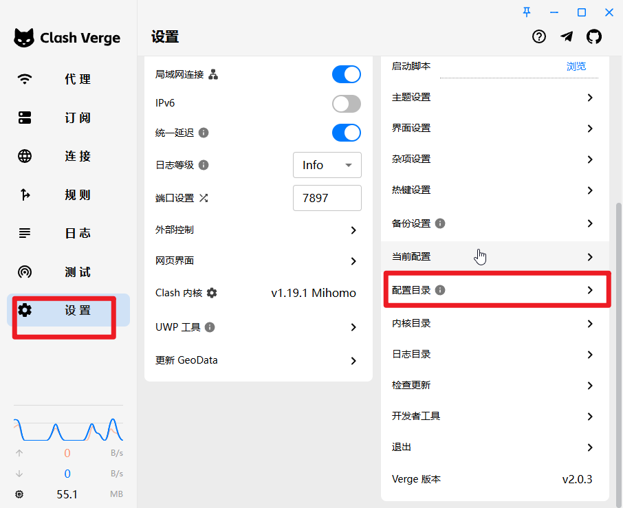

# 使用`mihomo`方式启动进行代理

### 背景

某些场景下，不需要`GUI`页面的方式启动代理（如`Linux`服务器），可以使用`mihomo`的方式进行代理设置

本质上，如`clash-verge`等`GUI`都是基于`mihomo`内核开发的


### 安装

为了尽可能的简化操作，先在允许`GUI`操作的机器上运行一次`clash-verge`,并能够正常的使用代理！

1.下载`mihomo`:[Releases · MetaCubeX/mihomo](https://github.com/MetaCubeX/mihomo/releases),并解压

2.找到`clash-verge`对应的配置文件



​	3.将`class-verge`配置文件夹下面的`cache.db,Country.mmdb,geoip.dat,geosite.dat`，同时将 `profiles`目录下`xxx.yaml`的复制到`mihomo`文件夹下（可能`XXX.yaml`有多个，找到实际正在使用的那一个代理）。然后将`XXX.yaml`改成`config.yaml`

4.修改配置（由于原来的`XXX.yaml`中的配置没有指定端口）

按需将如下的配置放到`config.yaml`配置中（按需添加，如果有重复的，以`XXX.yaml`为准）

```
# Generated by Clash Verge

mixed-port: 7893
socks-port: 7898
port: 7899
log-level: info
allow-lan: true
external-controller-cors:
  allow-private-network: true
  allow-origins:
  - ''

dns:
  enable: true
  ipv6: false
  use-system-hosts: false
  use-hosts: true
  enhanced-mode: fake-ip
  fake-ip-range: 198.18.0.1/16
  nameserver: [ https://223.6.6.6/dns-query, https://doh.pub/dns-query ]
  fallback-filter: { geoip: true, ipcidr: [ 240.0.0.0/4, 0.0.0.0/32 ] }
  fallback: [ 'tls://223.5.5.5:853', 'tls://119.29.29.29:853' ]
  default-nameserver: [ 119.29.29.29, 223.5.5.5 ]
```


​	4.启动	

```
使用windows命令举例
mihomo.exe -d .
```


### 后记

`windows`平台，如果希望将`exe`注册成服务，可以参考[使用nssm将exe,bat等注册成服务](../windows/使用nssm将exe,bat等注册成服务.md)

如果代理是基于`hysteria`协议，可以使用`hysteria`官方客户端进行操作；

