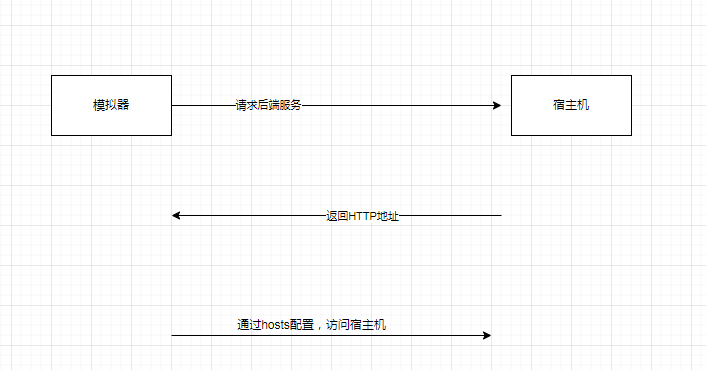

## AndroidStudio模拟器编辑hosts访问宿主机

### 需求

1. 自定义了一个域名，希望 AndroidStudio模拟器能够通过编辑`hosts`文件后，能够通过配置的`hosts`文件，访问到数据

   

### 背景/流程

​	1.模拟器中的`App`访问后端服务(部署在宿主机)

​	2.后端服务器访问一个 图片地址 (例如：`http://myhosts-bbk.com:8849/image/test.png`)

​	3.模拟器中的`App` 通过接收到的图片地址，访问到对应的图片



### 处理

1. 模拟器启动增加参数 `-writable-system`

   ```shell
   emulator -avd device1G -http-proxy 127.0.0.1:808 -gpu host  -writable-system
   
   #device1G 是设备名称
   ```

2. 重启模拟器

3. 找到 `platform-tools`文件夹(这个需要看自己配置在哪里)，文件夹内会有 `adb.exe`文件
   
4. 运行` .\adb.exe root`命令,获得 `root`权限

5. 运行` .\adb.exe remount`命令 （重新挂载、没太研究，应该是把权限 重新刷新了一下）

6. 将模拟器上面的`hosts`文件复制到本机

   ```powershell
   .\adb.exe pull /system/etc/hosts E:/hosts
   
   #注意  右边的路径是 本机路径，建议先提前创建好文件
   ```

7. 本机修改`hosts`文件

   ```ini
   127.0.0.1       localhost
   ::1             ip6-localhost
   #10.0.2.2  是宿主机的ip地址 ,这里希望访问 myhosts-bbk.com  域名时，访问宿主机ip 
   10.0.2.2 		myhosts-bbk.com  
     
   
   ```

8. 推送本机`hosts`到模拟器

   ```powershell
   .\adb.exe push E:/hosts /system/etc/hosts
    
   ```

9. 查看模拟器`hosts`的配置

   ```powershell
   .\adb.exe shell cat  /system/etc/hosts
   
   #看到配置的信息就成功了
    
   ```

10. 重启模拟器，打开浏览器测试

### 参考

[修改Android模拟器的hosts文件（权限） - 掘金 (juejin.cn)](https://juejin.cn/post/6844903949661667342)