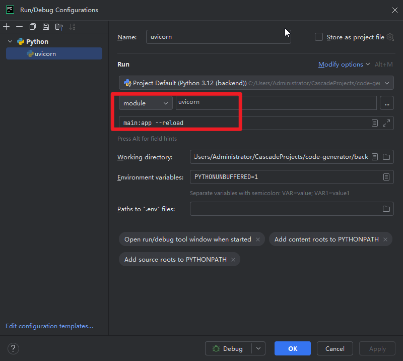

### 举例

```python
python -m uvicorn main:app --reload 
```

这个命令是用于启动一个使用`uvicorn`作为ASGI服务器的Python Web应用。下面是对这个命令的各个部分的解释：

1. `python`：这是Python解释器的命令，用于运行Python脚本。
2. `-m`：这是Python的一个命令行选项，用于运行模块。后面跟着的应该是模块名，而不是脚本文件名。
3. `uvicorn`：这是要运行的模块名。`uvicorn`是一个高性能的ASGI服务器，常用于运行Python Web框架如FastAPI、Starlette等。
4. `main:app`：这部分指定了要运行的ASGI应用程序。`main`是包含ASGI应用程序对象的模块名，`app`是该模块中ASGI应用程序对象的变量名。冒号用于分隔模块名和变量名。
5. `--reload`：这是一个命令行选项，用于启用自动重载。当你的代码发生变化时，`uvicorn`会自动重新启动服务器，这样在开发过程中可以实时看到代码更改的效果。

### PyCharm中使用调试模式同时启用FastAPI的热更新功能

1. **安装`uvicorn`**： 确保你已经安装了`uvicorn`，这是FastAPI的ASGI服务器。如果未安装，可以使用以下命令进行安装：

   ```python
   pip install uvicorn
   ```

2. **配置PyCharm调试器**：

   - 打开PyCharm，然后打开你的FastAPI项目。

   - 在PyCharm中，点击右上角的配置按钮（通常是一个下拉箭头旁边有一个齿轮图标）。

   - 选择“Edit Configurations…”。

   - 点击左上角的“+”号来添加一个新的Python配置。

   - 选择“Python”。

   - 在“Script path”或“Module name”字段中，输入`uvicorn`。

   - 在“Parameters”字段中，输入`main:app --reload`，其中`main`是你的主模块名，`app`是你的FastAPI应用实例的变量名。

   - 在“Python interpreter”字段中，选择你的项目使用的Python解释器。

   - 点击“OK”保存配置。

     

3. **启动调试会话**：

   - 在PyCharm的调试配置中，选择你刚刚创建的配置。
   - 点击调试按钮（通常是一个虫子图标）来启动调试会话。

4. **使用热更新功能**： 当你使用`--reload`参数启动`uvicorn`时，它会监控你的代码文件。一旦你保存了对代码的更改，`uvicorn`会自动重新启动服务器，从而实现热更新。