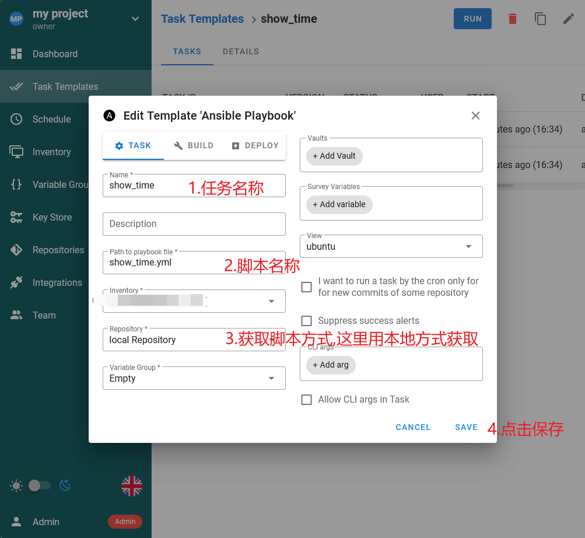

# semaphore教程

一句话介绍 Semaphore：Ansible 的现代化 UI，可以轻松管理和运行 Ansible playbook，功能强大，操作简单，支持中文。


本次目标机器是**Ubuntu 24 LTS**

**注: 需要目标机器有python3环境**


宿主机`docker`设置代理:

```
sudo mkdir -p /etc/systemd/system/docker.service.d
sudo vim /etc/systemd/system/docker.service.d/http-proxy.conf


填入代理服务器:
[Service]
Environment="HTTP_PROXY=http://127.0.0.1:8123"
Environment="HTTPS_PROXY=http://127.0.0.1:8123"

重启:
sudo systemctl daemon-reload
sudo systemctl restart docker

```


开放防火墙:


## 1.docker安装

```
docker run -d -p 33000:3000 --name semaphore \
  --restart=always \
  --user root \
  --privileged \
  -e SEMAPHORE_DB_DIALECT=bolt \
  -e SEMAPHORE_ADMIN=admin \
  -e SEMAPHORE_ADMIN_PASSWORD=changeme \
  -e SEMAPHORE_ADMIN_NAME=Admin \
  -e SEMAPHORE_ADMIN_EMAIL=admin@localhost \
  -v /home/semaphore:/home/semaphore \
  -v /var/lib/semaphore:/var/lib/semaphore \
  -v /etc/semaphore:/etc/semaphore \
  -v /tmp/semaphore:/tmp/semaphore \
  -d semaphoreui/semaphore:v2.13.0
  
# v2.13.0 修复了无法获取`ansible.cfg`问题(当被控端修改密码后,无法再链接,见issue(https://github.com/semaphoreui/semaphore/issues/2811)) 如无法使用,再用这个版本v2.12.17 
# SEMAPHORE_ADMIN_PASSWORD 可以修改成想要的密码
```

## 2.进入管理网页

```
http//:IP:33000

#输入账号密码
#如果访问不通
	1.可以先在服务器上面查看防火墙是否开了
        输入sudo ufw status回车，查看防火墙状态：inactive是关闭，active是开启。
        使用sudo ufw enable开启防火墙。
        使用sudo ufw disable关闭防火墙。
	2.如果你的客户端访问时,查看系统代理 是否排除了 这个IP(这个IP不应该走代理)
    3.使用wget http//:IP:33000, 如果能够正常的下载index.html ,那么则没有问题
    	root@ubuntu24:/etc/apt/apt.conf.d# wget http://192.168.229.250:33000
        --2025-03-18 10:51:39--  http://192.168.229.250:33000/
        Connecting to 192.168.229.1:17893... connected.
        Proxy request sent, awaiting response... 502 Bad Gateway
        2025-03-18 10:51:44 ERROR 502: Bad Gateway.
        如果你发现这是走了代理的,需要修改 /etc/profile
        	3.1 增加 export no_proxy="127.0.0.1,localhost,192.168.229.250"
        	3.2 source /etc/profile
        

    
	
```


## 3.创建认证方式(被控服务器的认证信息)


`KEY name`随便自己定义

Type 选择`Login with password `就是常规的账号密码模式

填入账号密码

## 4.创建需要目标服务器组(你想要操作的服务器)

1.选择`Inventory`

2.点击`NEW INVENTORY`

3.填入信息

3.1 名称随便

3.2 `user credentials` 和 `sudo credentials`  选择第3步创建的账号密码的名称

3.3 type 选择static

3.4在方框中输入目标的服务器的IP和端口

```
#比如,如果端口是 22 的话,可以只填IP
106.75.111.196:60022
```

3.5 保存

## 5.创建获取`Ansible Playbook`的方式

点击`Repositorires`-`NEW Repository`,在`URL or path `填入


## 6.在宿主机创建`Playbook`脚本

本次以打印当前时间为例

```
[root@lavm-auynr7dbbf ~]# cd /home/semaphore/
[root@lavm-auynr7dbbf semaphore]# vi show_time.yml

内容如下:

- name: #打印实时时间
  hosts: all
  tasks:
    - name: #获取实时时间
      ansible.builtin.shell: "date '+%Y-%m-%d %H:%M:%S'"
      register: current_time

    - name: #显示时间
      ansible.builtin.debug:
        var: current_time.stdout


```


## 5.创建任务

1.选择`Task Templates`

2.点击`NEW TEMPERALTE`,选择`Ansible Playbook`

填入信息



3.点击运行


当出现 success,那么则代表成功

